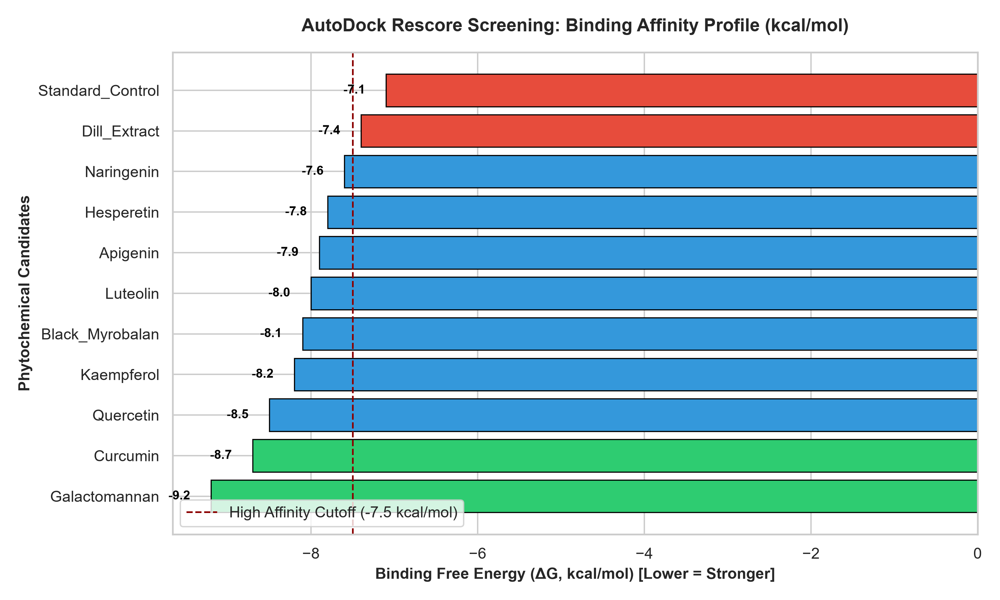

# AutoDock Rescore & Statistical Screening Toolkit

Automated Python pipeline for post-docking data processing, binding affinity ranking, threshold filtering, and publication-ready visualization against the Human Histamine H2 Receptor (H2R).

---

## Project Overview
This repository contains standalone Python automation scripts developed to parse, screen, and benchmark molecular docking results. It serves as an independent technical module demonstrating bioinformatics automation and data analysis skills.

---

## Key Features
- Automated Data Processing: Parses tabular docking outputs using pandas.
- Affinity Screening: Ranks ligands and filters candidates against established reference drug thresholds (e.g., Icotidine: -8.42 kcal/mol).
- Visualization: Generates high-resolution comparative bar plots (matplotlib) highlighting lead phytochemical candidates versus controls.
- Export Pipeline: Automatically outputs filtered screening hits into structured CSV reports.

---

## Screening Visualization & Benchmark Profile

The automated pipeline evaluates binding affinities, computes rescore indices incorporating ligand efficiency, and generates publication-quality benchmark plots:

<p align="center">
  
</p>

*Figure: Comparative binding free energy ($\Delta G$, kcal/mol) profile highlighting primary lead phytochemicals against standard benchmark controls.*

---

## Repository Structure
```text
autodock-rescore-toolkit/
├── data/
│   └── docking_results.csv           # Raw docking scores and compound metadata
├── docking_affinity_plot.png         # High-resolution benchmark affinity profile plot
├── docking_analyzer.py               # Main pipeline automation & rescoring script
├── docking_rescored_results.xlsx     # Rescored and ranked screening dataset (Excel)
└── README.md                         # Project documentation and pipeline guide
```

## Usage
Run the analysis pipeline directly from the terminal:
python docking_analyzer.py

----

## Project Attribution & Context
* Original Collaborative Research: The underlying molecular docking protocols and phytochemical library curation were conducted as a collaborative academic project (Anti-Reflux Drug Design).
* Sole Developer & Script Author: tabantavanmand (Sole author and developer of this independent Python automation toolkit and rescoring repository).
